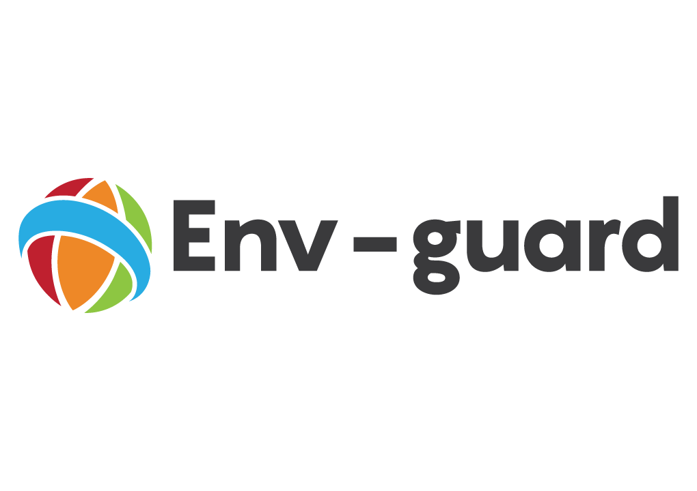

No more mistakes while messing around 'production like' environments.

Env-Guard is a chrome extension that lets you modify some parts of your chrome tabs. By doing so,
you can easily identify whether you should be extra careful or just do whatever you want in your app.

## Motivation:

The chances that you ever needed to log-in into the production instance of your app to either 
fix some urgent problem or maybe to investigate something are pretty high. So, it's very likely that in a normal day at
work you have multiple tabs of your app open and... as we all know sh** happens.

You thought you were browsing on the development instance of your app, where you are the "boss". 
So you deleted and changed bunch of stuff only to later realize that you were actually in the production instance. Oops!

## Scope:
The focus of this extension is to help developers, testers managers and IT people in general. You are of course more than welcome
to use this extension if you are not none of these people!. I just want to let it clear that the features here will always have this in mind.
If you need a tool to maintain your chrome tabs in a more generic way, you should definitely check this one out (inspired me on writing mine)
[Tab Modifier](https://github.com/sylouuu/chrome-tab-modifier)

## Features:

* Change the tab's Title
* Change the tab's favicon 

## Usage:
Refer to the [Usage Wiki Page](https://github.com/joaopgrassi/env-guard/wiki/Using-the-extension) for detailed usage documentation.

## License
Licensed under MIT
